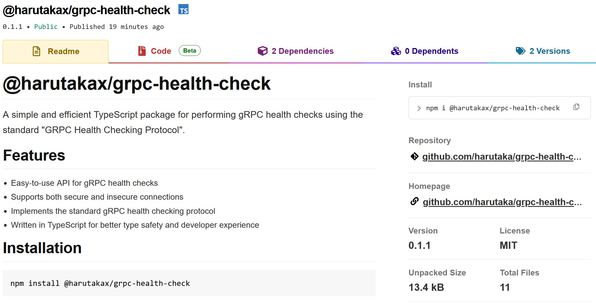

### URL

[@harutakax/grpc-health-check](https://www.npmjs.com/package/@harutakax/grpc-health-check)

### 説明

Node.js/Deno用のパッケージを作成しました。npmとJSRにて公開しています。

gRPC通信でのバックエンドの構築に携わった際、ヘルスチェックが意外と難しく、世の中に様々な手段はあれど、簡易に使用できる手段に乏しいと思ったので自作しました。

使い方の例としてES Modulesを記載していますが、CommonJSにも対応しています。

### 使用した技術

<Badge>gRPC</Badge>
<Badge>Deno</Badge>
<Badge>TypeScript</Badge>
<Badge>Connect</Badge>
<Badge>Buf</Badge>
